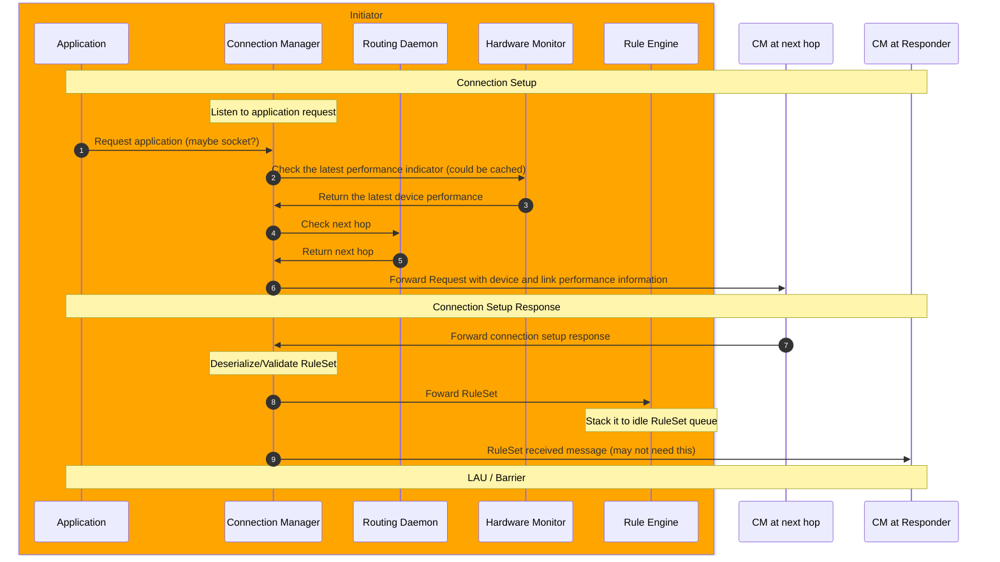
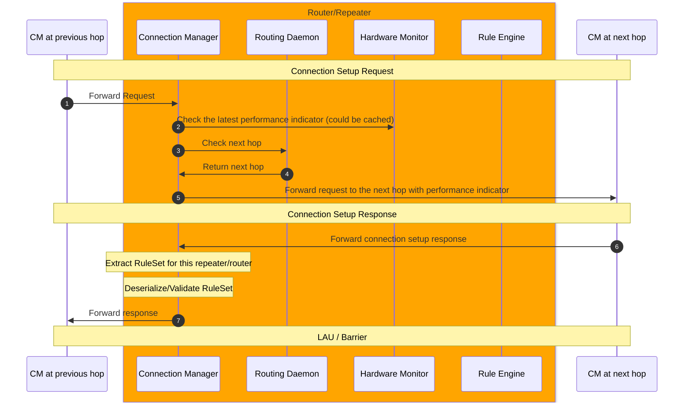
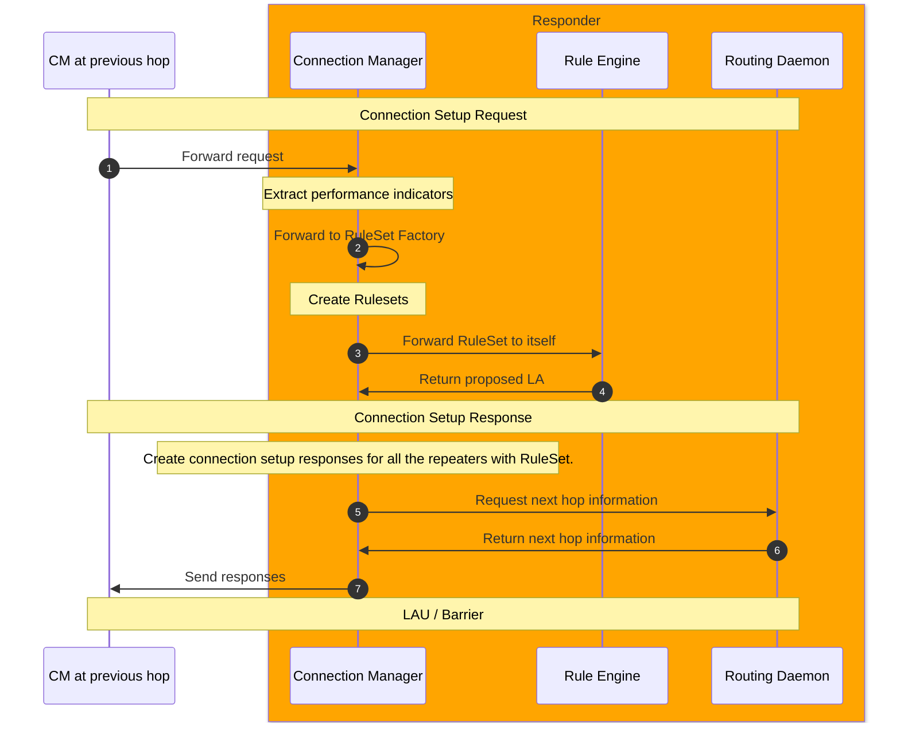
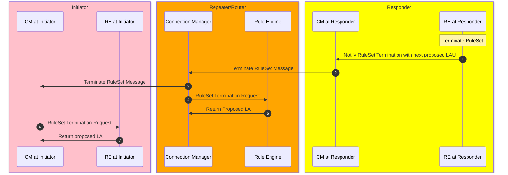
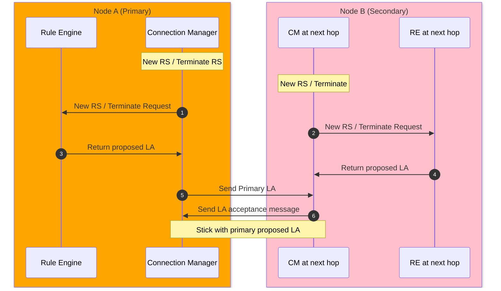

# Connection Manager (CM)
- [Connection Manager (CM)](#connection-manager-cm)
  - [Introduction](#introduction)
  - [Modules](#modules)
  - [Activity Diagrams](#activity-diagrams)
    - [Connection Setup (at Initiator)](#connection-setup-at-initiator)
    - [Connection Setup (at Repeater/Router)](#connection-setup-at-repeaterrouter)
  - [Connection Setup (at Responder)](#connection-setup-at-responder)
    - [Connection Teardown (at Initiator, Repeater/Router)](#connection-teardown-at-initiator-repeaterrouter)
    - [Link Allocation Update / Barrier](#link-allocation-update--barrier)
      - [Expected exceptions](#expected-exceptions)
  - [Data Structures](#data-structures)
  - [Message Contents](#message-contents)
  - [Variables](#variables)

## Introduction

## Modules
- connection_manager: The main module that communicates with external components
- message.rs: The model of message contents

## Activity Diagrams

### Connection Setup (at Initiator)
Related components: CM, Application, Routing Daemon, Rule Engine, Hardware MOnitor

### Connection Setup (at Repeater/Router)
Related components: CM, RuleEngine, Routing Daemon, Hardware Monitor

## Connection Setup (at Responder)
Related components: CM, RuleEngine, Routing Daemon, Hardware monitor

### Connection Teardown (at Initiator, Repeater/Router)
Related components: CM, RuleEngine

After CM gets negotiated LA with Barrier value and send it to RE, RE stop execution.
The next hop check also happens with routing daemon.

### Link Allocation Update / Barrier
Related components: CM, RE, 

> note: We might meta policy to align over the different links

Need to decide which is primary.

#### Expected exceptions
- 5: Inconsitent link information: CM at two nodes have different set of running RuleSet
- message inconsistent error: Only one of the nodes gets new RS or RS termination then send primary LA but no ruleset running at Secondary node

## Data Structures

## Message Contents
## Variables
|         key         |                             value                              | descripttions                                                |
| :-----------------: | :------------------------------------------------------------: | :----------------------------------------------------------- |
|      node_type      | Enum("Initiator", "Responder", "Repeater", "Router", "Switch") | A type of network node                                       |
| link_interface_list |                   List\[LinkInterfaceInfo\]                    | Link information cached in cm to store performance indicator |
|                     |                                                                |                                                              |