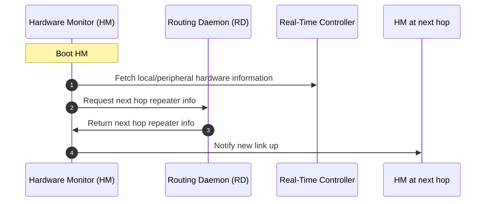
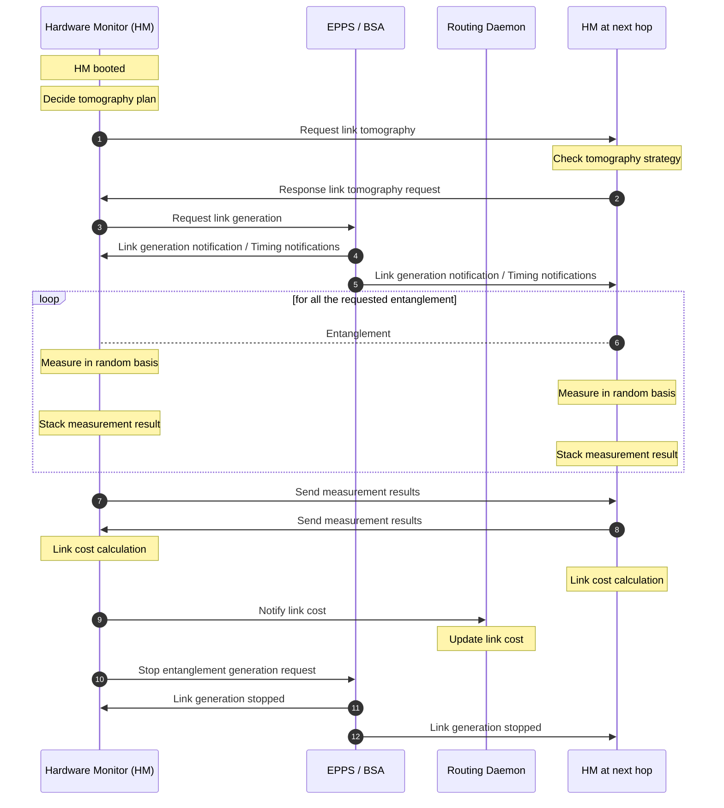
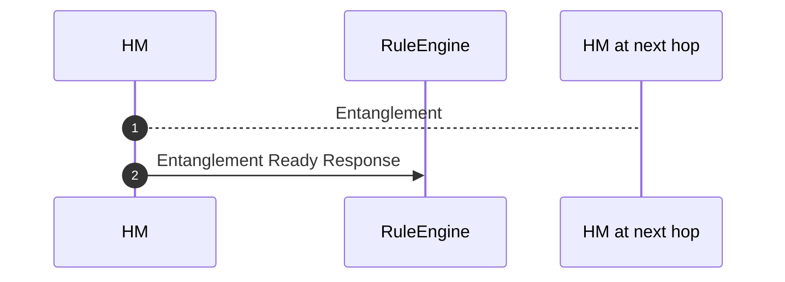
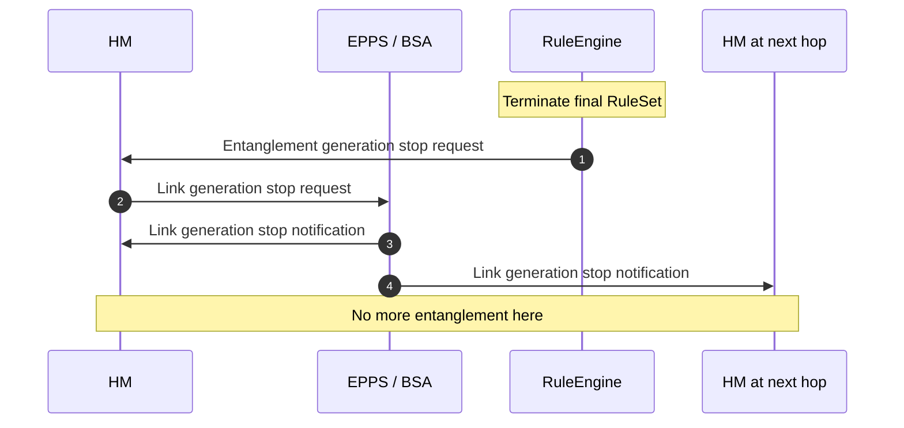

# Hardware Monitor (HM)- 
[Hardware Monitor (HM)](#hardware-monitor-hm)
- [Hardware Monitor (HM)-](#hardware-monitor-hm-)
  - [Introduction](#introduction)
  - [Interfaces](#interfaces)
  - [Activity Diagrams](#activity-diagrams)
    - [Boot component](#boot-component)
      - [Expected Exceptions](#expected-exceptions)
    - [Link cost calculation](#link-cost-calculation)
      - [Expected Exceptions](#expected-exceptions-1)
    - [Send link ready notification](#send-link-ready-notification)
    - [Stop link generation](#stop-link-generation)

## Introduction

## Interfaces
HM -> RD (caller)
- Update link cost

HM -> RE
- Link generation start
- Link generation stop

## Activity Diagrams
See detailed workflow in google drive (not publicly available)

### Boot component
Related Components: HM, EPPS/BSA

Device configuration contains a set of information about the intermediate entanglement generation devices such as EPPS generation, BSA acceptable photon numbers per sec, EPPS estimated generation rate etc. 

#### Expected Exceptions
- No device found: HM cannot establish connection with EPPS/BSA
- No config found: EPPS/BSA cannot provide their configuration in some reasons
- Request timeout: It takes too long to get response from EPPS/BSA
- Device config type invalid: The contents of device config is invalid

### Link cost calculation
Related Components: HM, EPPS/BSA, Routing Daemon (RD)

#### Expected Exceptions
Numbers are corresponding to the sequence numbers in the diagram
- 1. Request link tomography
  - Invalid request format: The request format for link tomography is invalid.
- 2. Response to link tomography request
  - Invalid response format: The response format for link tomography is invalid.

### Send link ready notification
Related Components: HM, RuleEngine

Once the link entanglement is ready, notify it to the RuleEngine.

### Stop link generation
Related Components: HM, EPPS/BSA, RuleEngine

When all the RE execution is done and no RuleSet is running, RE request link generation stop.

