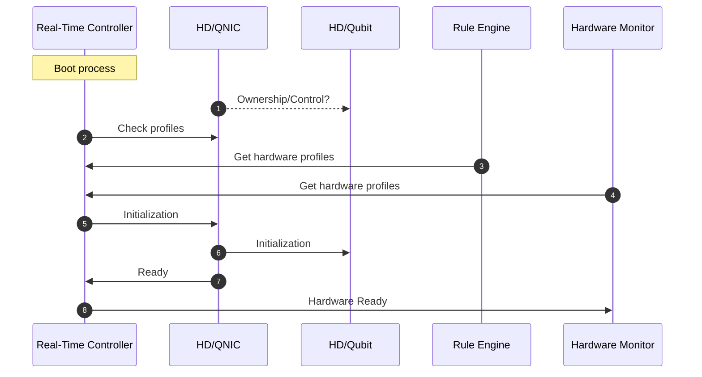
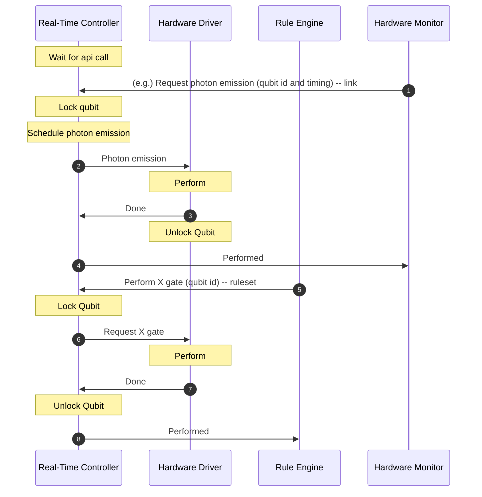
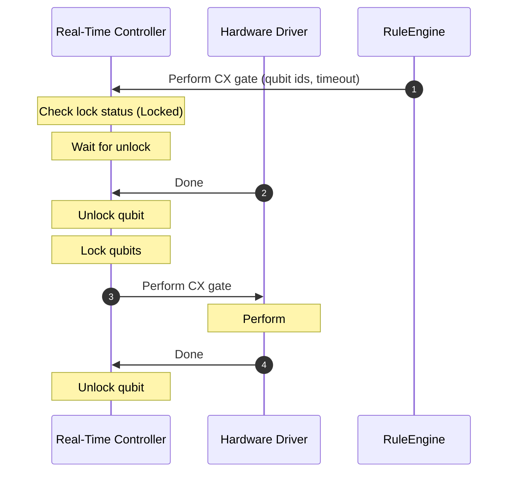
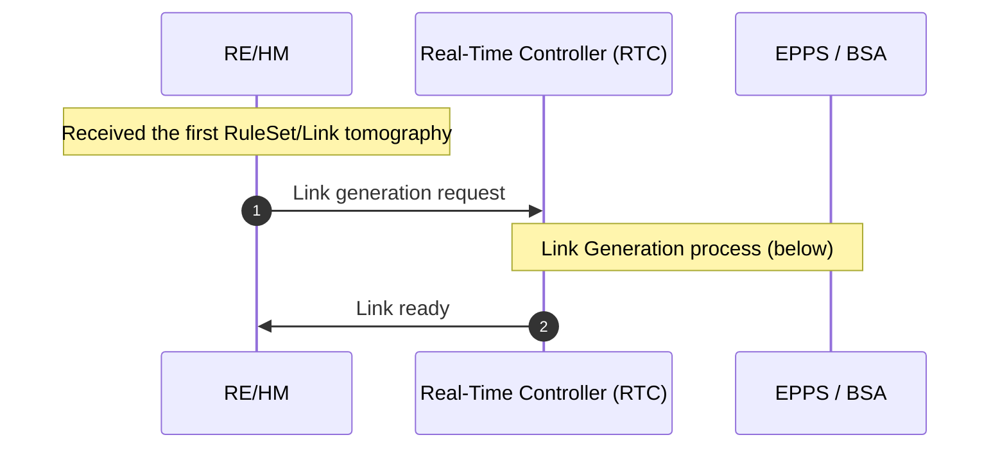
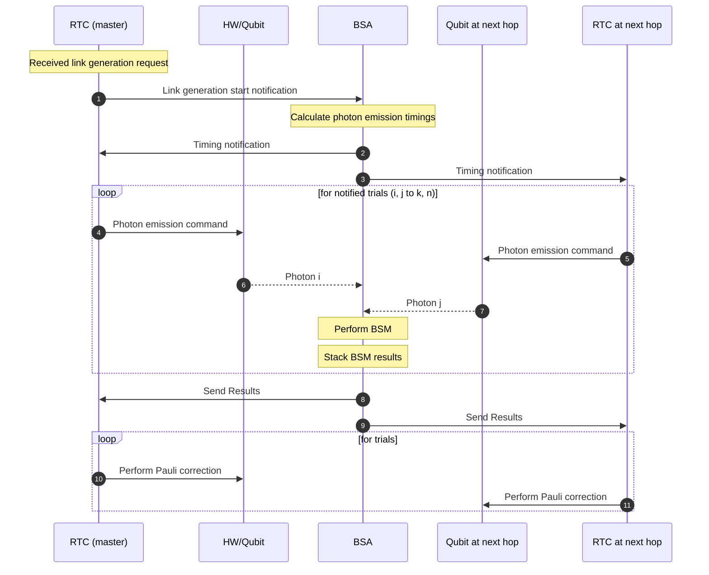
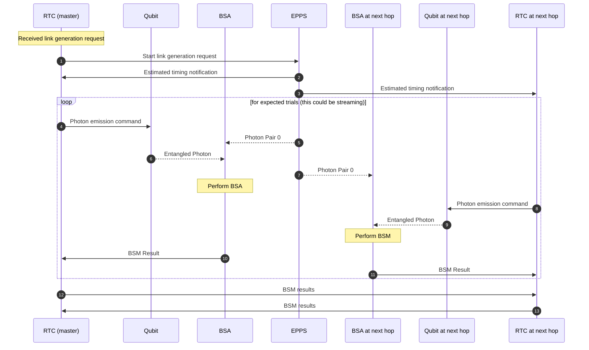

# Real-Time Controller(RTC)
- [Real-Time Controller(RTC)](#real-time-controllerrtc)
  - [Introduction](#introduction)
  - [Components](#components)
  - [Hardware Abstraction](#hardware-abstraction)
  - [Activity Diagrams](#activity-diagrams)
    - [Setup](#setup)
    - [Perform Instruction](#perform-instruction)
    - [Perform instruction to locked qubits](#perform-instruction-to-locked-qubits)
    - [Start link generation](#start-link-generation)
  - [Interfaces](#interfaces)
    - [Hardware](#hardware)
    - [Software](#software)

## Introduction
Real-Time Controller is a thin wrapper for Rule Engine to manipulate peripherals such as qubit controller, classical network interface.

## Components
- contoller.rs: A main process that communicates with RS, HW and Hardware Drivers
- instruction_converter.rs: Convert high level instructions into hardware dependent instruction sets.
  - Should be configurable with external config file
- hal_wrapper: Hardware abstraction layer wrapper to assume virtual hardwares are existeing

## Hardware Abstraction
In order for higher layer components to manipulate low layer devices such as qubit memories and real-time communication devices, 

## Activity Diagrams
### Setup
Related Components: RTC, HM, RE, Hardware Driver (HD)

### Perform Instruction
Related Components: RTC, HM, RE, HD

### Perform instruction to locked qubits
Related Components: RTC, HM, RE, HD

The instructions must be properly managed by higher components (such as RE, HM), however, in the case where there is multithreading, they might perform instructions to locked and used qubits.
Each instruction request must have timeout that specifies when the gate operation request is expired.

In the case where the instruction is scheduled but not performed yet, the qubit is still locked to ensure the exclusivity.

If the timeout exceeds, RTC returns error to corresponding components

### Start link generation 
Related Components: HM, EPPS/BSA, RuleEngine, Real-Time Controller

RTC get link entanglement generation request from either hardware monitor or rule engine

**BSA**

**EPPS**

## Interfaces

### Hardware
In this level, the granularity of the instruction is still vague. Actual operations are derived from these instructions.

- Stationary Qubit: matter qubits to store the quantum information
  - EmitPhoton: Emit a flying qubit entangled with stationary qubit.
  - GateX: X gate operation
  - GateY: Y gate operation
  - GateZ: Z gate operation
  - GateH: H gate operation
  - GateS: S gate operation
  - GateSdg: S dagger gate operation
  - GateT: T gate operation
  - GateTdg: T dagger gate operation
  - GateCX: CX gate operation
  - GateCX: CZ gate operation
  - Lock: Lock qubit to keep exclusiveness
  - Unlock: Unlock qubit for other thread to perform instructions
- Internal Flying BSA: Perform BSA for flying qubits
  - OpenDetector: Open photon detector to detect incoming photon
  - CloseDetector: Close photon detector
  - ExtractResult: Get detection results out of BSA
  - StreamResult (?): 
- Internal Stationary BSA: Bell state analyzer to peform internal Bell state measurement on stationary quantum memories
  - PerformBSA: Perform Bell state measurement between two stationary memories and return measurement results.
- ...

### Software
- RuleEngine, HardwareMonitor:
  - PerformInstruction: RuleEngine, HardwareMonitor can manipulate this API to perform instructions listed above
  - GetHardwareInformation: RE, HM can get hardware information
