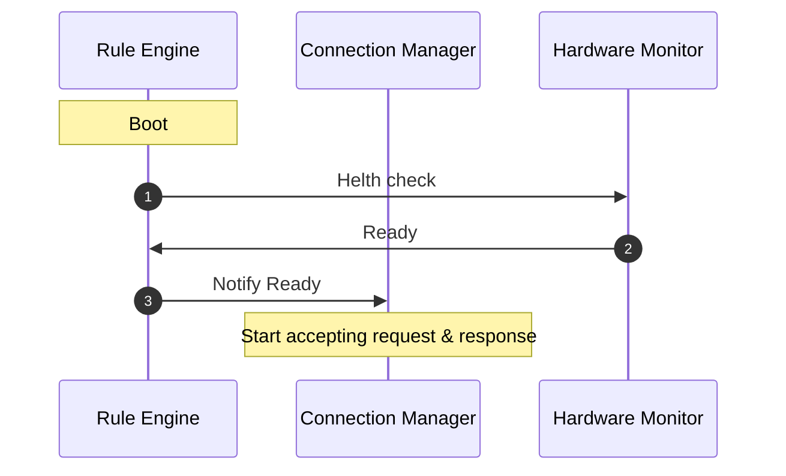
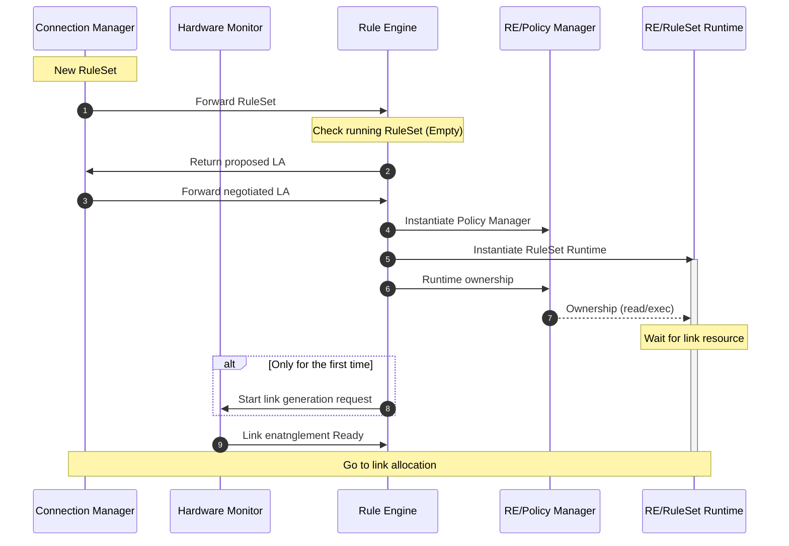
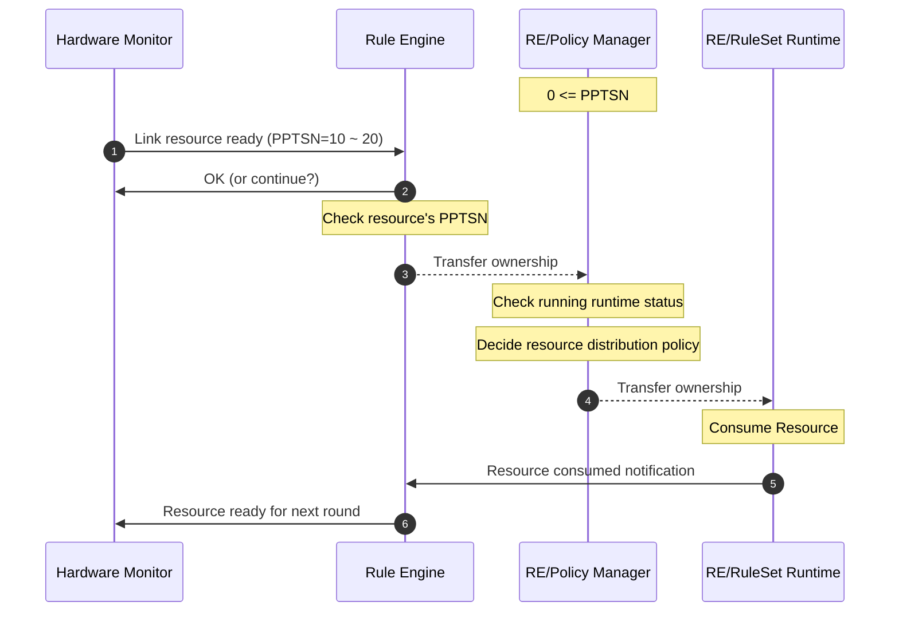
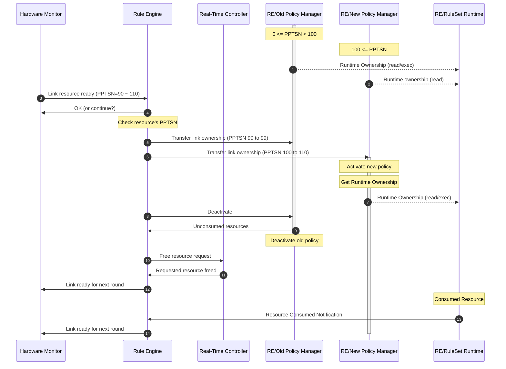
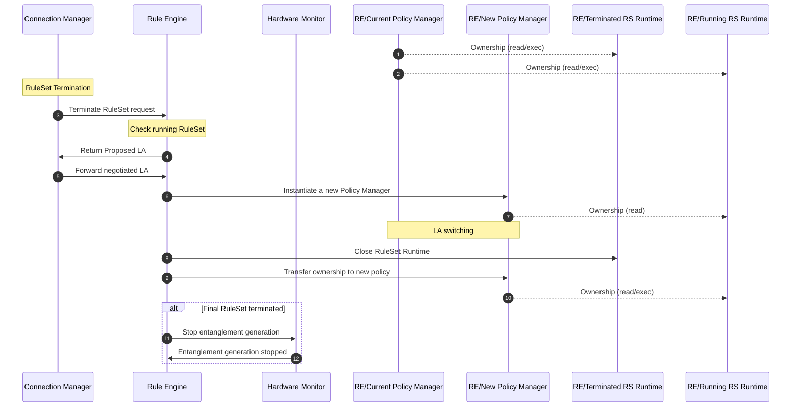
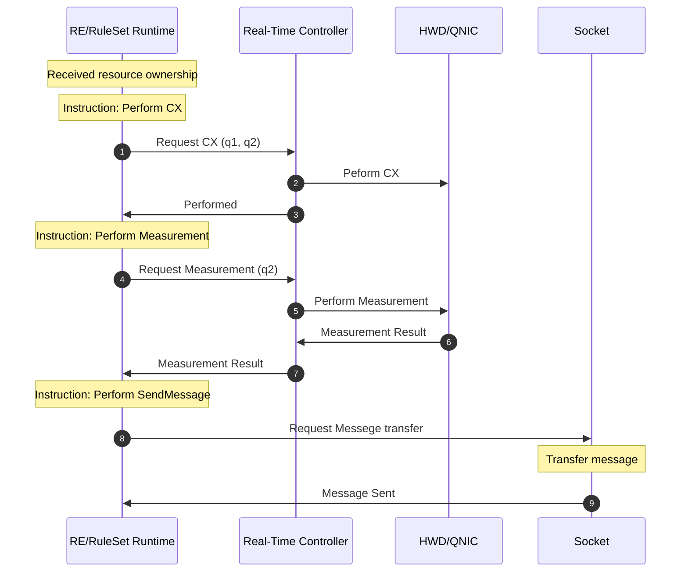

# Rule Engine (RE)
- [Rule Engine (RE)](#rule-engine-re)
  - [Introduction](#introduction)
  - [Activity Diagrams](#activity-diagrams)
    - [Idle (Booting -\> Waiting for RuleSet)](#idle-booting---waiting-for-ruleset)
    - [New RuleSet arrive](#new-ruleset-arrive)
    - [Link Allocation / Link Allocation Policy switching](#link-allocation--link-allocation-policy-switching)
    - [RuleSet termination message handling (Initiator / Repeater / Router)](#ruleset-termination-message-handling-initiator--repeater--router)
    - [RuleSet execution](#ruleset-execution)
  - [Data Structures](#data-structures)
  - [Message Contents](#message-contents)

## Introduction

## Activity Diagrams

### Idle (Booting -> Waiting for RuleSet)
Related components: RE, Connection Manager, Real-Time Controller, Hardware Monitor

### New RuleSet arrive
Related components: RE, Connetion Manager, Hardware Monitor

1. The case where there is no running RuleSet

### Link Allocation / Link Allocation Policy switching
Releated componentns: RE, HM

When there is one link allocation policy, all the resoruces go to one policy.

When there are two link allocation policies (active LA and proposed LA), link allocation policy has to be properly switched.

When there are multiple resources arrived at RE simultaneously, it might be diffuclt to handle transitions from old policy to new policy.

### RuleSet termination message handling (Initiator / Repeater / Router)
Related components: RE, Connection Manager, Hardware Monitor

### RuleSet execution
Related Components: RE/RuleSet Runtime, Real-Time Controller, Hardware Driver(HWD), Socket

## Data Structures

## Message Contents